# Stats & Web Services Refactor Plan

## Current Architecture Assessment

✅ **Already Done:**
- Pool has NO embedded web server
- Translator has NO embedded web server
- stats-pool exists as separate service
- stats-proxy exists as separate service

❌ **Current Problems:**
- Using individual event messages (Connect/Disconnect/Share/etc) - too fragile
- Hard to track connection state when services bounce
- Stats services need to infer state from stream of events

## Strategic Goals (Aligned with REBASE_SRI.md)

🎯 **Minimize SRI Code Changes** - Keep polling loops generic, use adapter traits
🎯 **Isolate Custom Logic** - Stats/web services are 100% hashpool code
🎯 **Rebase-Ready Structure** - Only tiny trait impls need updating during SRI rebases
🎯 **Enable Alternative UIs** - Separate web services allow TUI, mobile, Prometheus exporters

## Target Architecture

### 1. Service Overview

```
┌─────────────────────────────────────────────────────────────┐
│                    PROXY SIDE (Miner)                       │
├─────────────────────────────────────────────────────────────┤
│                                                             │
│  ┌──────────────┐   TCP Heartbeat   ┌──────────────────┐   │
│  │  Translator  │ ─────────────────> │  stats-proxy     │   │
│  │   (Proxy)    │   Every 5s         │  (Stats Service) │   │
│  │              │   ProxyInfo msg    │                  │   │
│  └──────┬───────┘                    └────────┬─────────┘   │
│         │                                     │             │
│         │ SV1 Mining                          │ HTTP        │
│         ▼                                     │ :8082       │
│    Downstream                                 ▼             │
│      Miners                          ┌──────────────────┐   │
│    (3-10 ASICs)                      │   web-proxy      │   │
│                                      │  (Web Service)   │   │
│                                      │  Polls HTTP      │   │
│                                      │  every 5s        │   │
│                                      └──────────────────┘   │
│                                             :3030           │
└─────────────────────────────────────────────────────────────┘

┌─────────────────────────────────────────────────────────────┐
│                    POOL SIDE (Operator)                     │
├─────────────────────────────────────────────────────────────┤
│                                                             │
│  ┌──────────────┐   TCP Heartbeat   ┌──────────────────┐   │
│  │     Pool     │ ─────────────────> │   stats-pool     │   │
│  │              │   Every 5s         │  (Stats Service) │   │
│  │              │   PoolInfo msg     │                  │   │
│  └──────┬───────┘                    └────────┬─────────┘   │
│         │                                     │             │
│         │ SV2 Mining                          │ HTTP        │
│         │ + Mint/JD                           │ :8083       │
│         ▼                                     ▼             │
│    Downstream                        ┌──────────────────┐   │
│    Translators                       │    web-pool      │   │
│    + Services                        │  (Web Service)   │   │
│    (1-5 proxies)                     │  Polls HTTP      │   │
│                                      │  every 5s        │   │
│                                      └──────────────────┘   │
│                                             :8081           │
└─────────────────────────────────────────────────────────────┘
```

### 2. SRI Isolation Strategy - Adapter Traits

**Critical Design: Minimize SRI Touch Points**

```
┌────────────────────────────────────────────────────────┐
│                  SRI CODE (Fork)                       │
├────────────────────────────────────────────────────────┤
│                                                        │
│  Translator/Pool                                       │
│  ┌─────────────────────────────────────┐             │
│  │ Core SRI Mining Logic               │             │
│  │ (unchanged)                          │             │
│  └───────────┬─────────────────────────┘             │
│              │                                         │
│      ┌───────▼──────────┐                             │
│      │ Trait Impl       │  <- ~30 lines per role      │
│      │ StatsAdapter     │     (ONLY SRI touch)        │
│      └───────┬──────────┘                             │
│              │                                         │
└──────────────┼─────────────────────────────────────────┘
               │
               │ Trait boundary
               │
┌──────────────▼─────────────────────────────────────────┐
│              HASHPOOL CODE (Pure)                      │
├────────────────────────────────────────────────────────┤
│                                                        │
│  ┌─────────────────────┐                              │
│  │  Polling Loop       │  <- Uses trait, no SRI       │
│  │  (every 5s)         │                              │
│  └──────────┬──────────┘                              │
│             │                                          │
│             ▼                                          │
│  ┌─────────────────────┐                              │
│  │  StatsClient        │                              │
│  │  (TCP sender)       │                              │
│  └──────────┬──────────┘                              │
│             │                                          │
│             │ TCP JSON                                 │
│             ▼                                          │
│  ┌─────────────────────┐      ┌──────────────────┐   │
│  │  stats-proxy/pool   │ <────│  web-proxy/pool  │   │
│  └─────────────────────┘      └──────────────────┘   │
│                                                        │
└────────────────────────────────────────────────────────┘
```

**Adapter Trait Definition** (in `roles/roles-utils/src/stats_adapter.rs` - Pure Hashpool):

```rust
use serde::{Deserialize, Serialize};

/// Trait for collecting stats snapshot from hub services
/// Implemented by Pool and Translator to expose their state
pub trait StatsSnapshotProvider {
    type Snapshot: Serialize + for<'de> Deserialize<'de>;

    fn get_snapshot(&self) -> Self::Snapshot;
}

// Proxy-specific snapshot types
#[derive(Debug, Clone, Serialize, Deserialize)]
pub struct ProxySnapshot {
    pub ehash_balance: u64,
    pub upstream_pool: Option<PoolConnection>,
    pub downstream_miners: Vec<MinerInfo>,
    pub timestamp: u64,
}

#[derive(Debug, Clone, Serialize, Deserialize)]
pub struct PoolConnection {
    pub address: String,
}

#[derive(Debug, Clone, Serialize, Deserialize)]
pub struct MinerInfo {
    pub name: String,
    pub id: u32,
    pub address: String,
    pub hashrate: f64,
    pub shares_submitted: u64,
    pub connected_at: u64,
}

// Pool-specific snapshot types
#[derive(Debug, Clone, Serialize, Deserialize)]
pub struct PoolSnapshot {
    pub services: Vec<ServiceConnection>,
    pub downstream_proxies: Vec<ProxyConnection>,
    pub listen_address: String,
    pub timestamp: u64,
}

#[derive(Debug, Clone, Serialize, Deserialize)]
pub struct ServiceConnection {
    pub service_type: ServiceType,
    pub address: String,
}

#[derive(Debug, Clone, Serialize, Deserialize)]
pub enum ServiceType {
    Mint,
    JobDeclarator,
}

#[derive(Debug, Clone, Serialize, Deserialize)]
pub struct ProxyConnection {
    pub id: u32,
    pub address: String,
    pub channels: Vec<u32>,
    pub shares_submitted: u64,
    pub quotes_created: u64,
    pub ehash_mined: u64,
    pub last_share_at: Option<u64>,
}
```

**Trait Implementation** (in `roles/translator/src/stats_integration.rs` - Minimal SRI glue):

```rust
use roles_utils::stats_adapter::*;

impl StatsSnapshotProvider for TranslatorState {
    type Snapshot = ProxySnapshot;

    fn get_snapshot(&self) -> ProxySnapshot {
        // Map SRI internal state to hashpool types
        let ehash_balance = self.wallet
            .total_balance()
            .await
            .unwrap_or(0);

        let upstream_pool = self.upstream.as_ref()
            .filter(|conn| conn.is_connected())
            .map(|conn| {
                PoolConnection {
                    address: conn.address.to_string(),
                }
            });

        let downstream_miners = self.downstream_connections
            .iter()
            .map(|(id, conn)| {
                MinerInfo {
                    name: conn.user_identity.clone(),
                    id: *id,
                    address: conn.addr.to_string(),
                    hashrate: conn.hashrate_tracker.current(),
                    shares_submitted: conn.share_counter,
                    connected_at: conn.connected_timestamp,
                }
            })
            .collect();

        ProxySnapshot {
            ehash_balance,
            upstream_pool,
            downstream_miners,
            timestamp: unix_timestamp(),
        }
    }
}
```

**Generic Polling Loop** (in `roles/roles-utils/src/stats_poller.rs` - Pure Hashpool):

```rust
use std::sync::Arc;
use std::time::Duration;
use tokio::sync::Mutex;
use crate::stats_adapter::StatsSnapshotProvider;
use crate::stats_client::StatsClient;

/// Generic polling loop that works with any StatsSnapshotProvider
pub async fn start_stats_polling<T>(
    provider: Arc<Mutex<T>>,
    client: StatsClient<T::Snapshot>,
) where
    T: StatsSnapshotProvider + Send + 'static,
    T::Snapshot: Send + 'static,
{
    let mut interval = tokio::time::interval(Duration::from_secs(5));

    loop {
        interval.tick().await;

        // Get snapshot via trait - no SRI coupling here
        let snapshot = {
            let guard = provider.lock().await;
            guard.get_snapshot()
        };

        // Send to stats service
        client.send_snapshot(snapshot).await;
    }
}
```

**Usage in Translator Main** (in `roles/translator/src/main.rs` - Minimal change):

```rust
// After translator state is initialized
let translator_state = Arc::new(Mutex::new(state));
let stats_client = StatsClient::new(config.stats_proxy_address);

// Spawn generic polling loop - no SRI code here!
tokio::spawn(roles_utils::stats_poller::start_stats_polling(
    translator_state.clone(),
    stats_client,
));
```

### 3. Message Definitions

**ProxyInfo** (Translator → stats-proxy, every 5s):
```rust
// Defined in roles/roles-utils/src/stats_adapter.rs (shown above)
// This is the ProxySnapshot type
```

**PoolInfo** (Pool → stats-pool, every 5s):
```rust
// Defined in roles/roles-utils/src/stats_adapter.rs (shown above)
// This is the PoolSnapshot type
```

### 4. Data Flow Diagrams

**Proxy Side Heartbeat Flow:**

```mermaid
sequenceDiagram
    participant T as Translator
    participant A as StatsAdapter Trait
    participant P as Polling Loop
    participant SP as stats-proxy
    participant WP as web-proxy
    participant B as Browser

    Note over P: Generic polling loop (pure hashpool)

    loop Every 5 seconds
        P->>T: get_snapshot() via trait
        T->>T: Map SRI state → ProxySnapshot
        T->>P: ProxySnapshot
        P->>SP: JSON over TCP
        SP->>SP: Store snapshot in DB
        SP->>SP: Update timestamp
    end

    loop Every 5 seconds
        WP->>SP: GET /api/stats (HTTP)
        SP->>WP: JSON snapshot
        WP->>WP: Update in-memory state
    end

    B->>WP: GET /miners
    WP->>B: HTML page
    B->>WP: GET /api/miners (AJAX)
    WP->>B: JSON from memory
```


**Pool Side Heartbeat Flow:**

```mermaid
sequenceDiagram
    participant P as Pool
    participant A as StatsAdapter Trait
    participant PL as Polling Loop
    participant SP as stats-pool
    participant WP as web-pool
    participant B as Browser

    Note over PL: Generic polling loop (pure hashpool)

    loop Every 5 seconds
        PL->>P: get_snapshot() via trait
        P->>P: Map SRI state → PoolSnapshot
        P->>PL: PoolSnapshot
        PL->>SP: JSON over TCP
        SP->>SP: Store snapshot in DB
        SP->>SP: Update timestamp
    end

    loop Every 5 seconds
        WP->>SP: GET /api/stats (HTTP)
        SP->>WP: JSON snapshot
        WP->>WP: Update in-memory state
    end

    B->>WP: GET /
    WP->>B: HTML page
    B->>WP: GET /api/connections (AJAX)
    WP->>B: JSON from memory
```


### 5. Component Responsibilities

**Translator (Minimal SRI Changes):**
- Implement `StatsSnapshotProvider` trait (~30 lines)
- Spawn generic polling loop (2 lines)
- Total SRI touch: ~35 lines

**Pool (Minimal SRI Changes):**
- Implement `StatsSnapshotProvider` trait (~40 lines)
- Spawn generic polling loop (2 lines)
- Total SRI touch: ~45 lines

**roles-utils (NEW - Pure Hashpool):**
- Define `StatsSnapshotProvider` trait
- Define snapshot data types (ProxySnapshot, PoolSnapshot)
- Implement generic polling loop
- Implement StatsClient (TCP sender)
- Total: ~300 lines, zero SRI coupling

**stats-proxy (Updated - Pure Hashpool):**
- Listen on TCP port for ProxySnapshot JSON messages
- Parse newline-delimited JSON
- Store entire snapshot **in memory** using `Arc<RwLock<Option<ProxySnapshot>>>`
- Expose HTTP endpoints:
  - `GET /api/stats` - Full current state (includes timestamp for client-side staleness detection)
  - `GET /api/miners` - Just miner list (for compatibility)
  - `GET /api/balance` - Just balance (for compatibility)
  - `GET /health` - Health check (returns 503 if no update in 15s)
- NO cleanup task needed - snapshot is authoritative
- NO database dependency - simple in-memory storage

**stats-pool (Updated - Pure Hashpool):**
- Listen on TCP port for PoolSnapshot JSON messages
- Parse newline-delimited JSON
- Store entire snapshot **in memory** using `Arc<RwLock<Option<PoolSnapshot>>>`
- Expose HTTP endpoints:
  - `GET /api/stats` - Full current state (includes timestamp for client-side staleness detection)
  - `GET /api/services` - Just services (for compatibility)
  - `GET /api/connections` - Just connections (for compatibility)
  - `GET /health` - Health check (returns 503 if no update in 15s)
- NO cleanup task needed - snapshot is authoritative
- NO database dependency - simple in-memory storage

**web-proxy (NEW Service - Pure Hashpool):**
- HTTP server on port 3030
- Poll stats-proxy `/api/stats` every 5 seconds
- Store snapshot in memory: `Arc<RwLock<ProxySnapshot>>`
- Serve HTML pages:
  - `/` - Wallet page (balance from snapshot)
  - `/miners` - Miners page (miners list from snapshot)
  - `/pool` - Pool page (upstream pool info from snapshot)
- Serve JSON endpoints from memory for frontend AJAX
- Total: ~600 lines, zero SRI coupling

**web-pool (NEW Service - Pure Hashpool):**
- HTTP server on port 8081
- Poll stats-pool `/api/stats` every 5 seconds
- Store snapshot in memory: `Arc<RwLock<PoolSnapshot>>`
- Serve HTML page:
  - `/` - Dashboard with services table + proxies table
- Serve JSON endpoints from memory for frontend AJAX
- Total: ~600 lines, zero SRI coupling

### 6. Staleness Detection

**In stats-proxy:**
- If no ProxySnapshot received for >15 seconds, mark data as stale
- Return last known state with `stale: true` flag
- Frontend can show "Connection Lost" indicator

**In stats-pool:**
- If no PoolSnapshot received for >15 seconds, mark data as stale
- Return last known state with `stale: true` flag
- Frontend can show "Connection Lost" indicator

### 7. Implementation Steps with Testable Deliverables

**Testing Philosophy:**
- Each phase has automated unit tests for core functionality
- Each phase ends with a human smoke test running `devenv up`
- Tests are simple and focused on verifying basic behavior
- Integration testing happens via smoke tests with full stack

---

**Phase 1: Create Adapter Layer (Pure Hashpool)** ✅ COMPLETE

**Deliverable 1.1: Data Types & Trait Definition** ✅ COMPLETE
- ✅ Created `roles/roles-utils/stats/src/stats_adapter.rs`
  - ✅ Defined `StatsSnapshotProvider` trait
  - ✅ Defined `ProxySnapshot` and `PoolSnapshot` types
  - ✅ Defined all supporting types (MinerInfo, ServiceConnection, etc.)

**Unit Tests:**
```rust
#[cfg(test)]
mod tests {
    use super::*;

    #[test]
    fn test_snapshot_serialization() {
        // Test ProxySnapshot serializes to JSON correctly
        let snapshot = ProxySnapshot {
            ehash_balance: 1000,
            upstream_pool: Some(PoolConnection {
                address: "pool.example.com:3333".to_string(),
            }),
            downstream_miners: vec![
                MinerInfo {
                    name: "miner1".to_string(),
                    id: 1,
                    address: "192.168.1.100:4444".to_string(),
                    hashrate: 100.5,
                    shares_submitted: 42,
                    connected_at: 1234567890,
                }
            ],
            timestamp: 1234567890,
        };

        let json = serde_json::to_string(&snapshot).unwrap();
        let deserialized: ProxySnapshot = serde_json::from_str(&json).unwrap();
        assert_eq!(deserialized.ehash_balance, 1000);
        assert_eq!(deserialized.downstream_miners.len(), 1);
    }

    #[test]
    fn test_pool_snapshot_serialization() {
        // Test PoolSnapshot serializes to JSON correctly
        let snapshot = PoolSnapshot {
            services: vec![
                ServiceConnection {
                    service_type: ServiceType::Mint,
                    address: "127.0.0.1:8080".to_string(),
                }
            ],
            downstream_proxies: vec![],
            listen_address: "0.0.0.0:34254".to_string(),
            timestamp: 1234567890,
        };

        let json = serde_json::to_string(&snapshot).unwrap();
        assert!(json.contains("Mint"));
    }
}
```

**Human Smoke Test:**
```bash
cd roles/roles-utils && cargo test --lib stats_adapter
# Should see: test result: ok
```

---

**Deliverable 1.2: Stats Client** ✅ COMPLETE
- ✅ Created `roles/roles-utils/stats/src/stats_client.rs`
  - ✅ TCP client that sends JSON snapshots
  - ✅ Newline-delimited JSON format
  - ✅ Generic over snapshot type
  - ✅ Auto-reconnect on failure

**Unit Tests:**
```rust
#[cfg(test)]
mod tests {
    use super::*;
    use tokio::net::TcpListener;

    #[tokio::test]
    async fn test_stats_client_sends_json() {
        // Start a mock TCP server
        let listener = TcpListener::bind("127.0.0.1:0").await.unwrap();
        let addr = listener.local_addr().unwrap();

        tokio::spawn(async move {
            let (mut socket, _) = listener.accept().await.unwrap();
            let mut buf = vec![0u8; 1024];
            let n = socket.read(&mut buf).await.unwrap();
            let received = String::from_utf8_lossy(&buf[..n]);
            assert!(received.contains("ehash_balance"));
            assert!(received.ends_with('\n'));
        });

        // Send snapshot via client
        let client = StatsClient::<ProxySnapshot>::new(addr.to_string());
        let snapshot = ProxySnapshot {
            ehash_balance: 500,
            upstream_pool: None,
            downstream_miners: vec![],
            timestamp: 123456,
        };
        client.send_snapshot(snapshot).await.unwrap();
    }
}
```

**Human Smoke Test:**
```bash
cd roles/roles-utils && cargo test --lib stats_client
# Should see: test result: ok
```

---

**Deliverable 1.3: Generic Polling Loop** ✅ COMPLETE
- ✅ Created `roles/roles-utils/stats/src/stats_poller.rs`
  - ✅ Implemented generic polling loop
  - ✅ Takes `Arc<Mutex<dyn StatsSnapshotProvider>>`
  - ✅ Calls `get_snapshot()` every 5s
  - ✅ Zero SRI knowledge

**No Unit Tests** (polling loop requires time-based testing, validated via smoke test)

**Human Smoke Test:** ✅ COMPLETE
```bash
# Polling loop will be tested in Phase 4 when integrated with translator/pool
# Verify it compiles
cd roles/roles-utils && cargo build
```

**Phase 1 Complete - Verify:** ✅ COMPLETE
```bash
cd roles && cargo test --lib roles-utils
# All unit tests pass
cargo build --workspace
# Whole workspace still compiles
```

**Phase 1 Summary:**
- Created new `roles/roles-utils/stats` crate
- Implemented adapter trait pattern for minimal SRI coupling
- All core infrastructure in place for snapshot-based stats collection

---

**Phase 2: Update Stats Services (Pure Hashpool)** ✅ COMPLETE

**Deliverable 2.1: Update stats-proxy** ✅ COMPLETE
- Changed message handling from events → snapshots
- Replaced SQLite with in-memory storage (`Arc<RwLock<Option<ProxySnapshot>>>`)
- Removed cleanup task
- Updated HTTP API to serve snapshots with timestamp (client-side staleness detection)
- Health endpoint uses server-side staleness check (15s threshold)

**Unit Tests:** ✅ COMPLETE (10 tests passing)
```rust
// In roles/stats-proxy/src/db.rs
#[cfg(test)]
mod tests {
    use super::*;

    #[test]
    fn test_store_and_retrieve_snapshot() {
        let db = StatsDatabase::new();

        let snapshot = ProxySnapshot {
            ehash_balance: 1000,
            upstream_pool: None,
            downstream_miners: vec![],
            timestamp: unix_timestamp(),
        };

        db.store_snapshot(snapshot);
        let retrieved = db.get_latest_snapshot().unwrap();
        assert_eq!(retrieved.ehash_balance, 1000);
    }

    #[test]
    fn test_staleness_detection() {
        let db = StatsDatabase::new();

        // Store old snapshot (30 seconds ago)
        let old_snapshot = ProxySnapshot {
            ehash_balance: 100,
            upstream_pool: None,
            downstream_miners: vec![],
            timestamp: unix_timestamp() - 30,
        };
        db.store_snapshot(old_snapshot);

        assert!(db.is_stale(15), "Should be stale after 30 seconds");
    }
}
```

**Human Smoke Test:** ✅ COMPLETE
```bash
cd roles/stats-proxy && cargo test
# All tests pass (10 tests)

# Start stats-proxy manually
cargo run -- -c ../../config/stats-proxy.config.toml

# In another terminal, send test snapshot
echo '{"ehash_balance":500,"upstream_pool":null,"downstream_miners":[],"timestamp":1234567890}' | nc localhost 8082

# Check HTTP API
curl http://localhost:8082/api/stats
# Should return the snapshot we sent
```

---

**Deliverable 2.2: Update stats-pool** ✅ COMPLETE
- Changed message handling from events → snapshots
- Replaced SQLite with in-memory storage (`Arc<RwLock<Option<PoolSnapshot>>>`)
- Removed cleanup task
- Removed rusqlite dependency from Cargo.toml
- Removed db_path from config (no longer needed)
- Updated HTTP API to serve snapshots (`/api/stats` endpoint)
- Renamed `StatsDatabase` to `StatsData` (consistent with stats-proxy)

**Unit Tests:** ✅ COMPLETE (9 tests passing)
```rust
// In roles/stats-pool/src/db.rs
#[cfg(test)]
mod tests {
    use super::*;

    #[test]
    fn test_store_pool_snapshot() {
        let store = StatsData::new();

        let snapshot = PoolSnapshot {
            services: vec![],
            downstream_proxies: vec![],
            listen_address: "0.0.0.0:34254".to_string(),
            timestamp: 1234567890,
        };

        store.store_snapshot(snapshot.clone());
        let retrieved = store.get_latest_snapshot().unwrap();
        assert_eq!(retrieved.listen_address, "0.0.0.0:34254");
    }
}
```

**Human Smoke Test:**
```bash
cd roles/stats-pool && cargo test
# 9 tests pass

# Start stats-pool manually
cargo run -- --tcp-address 127.0.0.1:8083 --http-address 127.0.0.1:8084

# Send test snapshot
echo '{"services":[],"downstream_proxies":[],"listen_address":"0.0.0.0:34254","timestamp":1234567890}' | nc localhost 8083

# Check HTTP API
curl http://localhost:8084/api/stats
# Should return the snapshot
```

**Phase 2 Complete - Verify:** ✅ COMPLETE
```bash
cargo test --package stats_pool
# All tests pass (9 tests)
cargo build --package stats_pool
# Compiles successfully
```

---

**Phase 3: Create Web Services (Pure Hashpool)**

**Deliverable 3.1: Create web-proxy service** ✅ COMPLETE
- ✅ New crate: `roles/web-proxy`
- ✅ HTTP server on port 3030
- ✅ Polling loop fetching from stats-proxy every 5s
- ✅ In-memory state storage with staleness detection
- ✅ Serve 3 HTML pages (wallet with mint/faucet, miners, pool)
- ✅ Config-driven (no hard-coded addresses)
- ✅ Faucet proxy to translator's /mint/tokens endpoint
- ✅ Health endpoint with 503 on stale data

**Unit Tests:**
```rust
// In roles/web-proxy/src/lib.rs
#[cfg(test)]
mod tests {
    use super::*;

    #[test]
    fn test_snapshot_storage() {
        let storage = SnapshotStorage::new();

        let snapshot = ProxySnapshot {
            ehash_balance: 750,
            upstream_pool: None,
            downstream_miners: vec![],
            timestamp: 123,
        };

        storage.update(snapshot.clone());
        let retrieved = storage.get();
        assert_eq!(retrieved.ehash_balance, 750);
    }

    #[tokio::test]
    async fn test_http_endpoints_exist() {
        // Test that all required endpoints return 200 OK
        let storage = Arc::new(SnapshotStorage::new());
        let app = create_router(storage);

        // Test /api/miners endpoint
        let response = app
            .oneshot(Request::builder().uri("/api/miners").body(Body::empty()).unwrap())
            .await
            .unwrap();
        assert_eq!(response.status(), StatusCode::OK);
    }
}
```

**Human Smoke Test:** ✅ COMPLETE
```bash
cd roles/web-proxy && cargo test
# ✅ 3 tests passing

# Start stats-proxy
cargo run --package stats_proxy -- \
  --tcp-address 127.0.0.1:8082 \
  --http-address 127.0.0.1:8084 \
  --db-path /tmp/stats-proxy.db \
  --config ../config/tproxy.config.toml \
  --shared-config ../config/shared/miner.toml

# Start web-proxy
cargo run --package web_proxy -- \
  --stats-proxy-url http://127.0.0.1:8084 \
  --web-address 127.0.0.1:3030 \
  --config ../config/tproxy.config.toml \
  --shared-config ../config/shared/miner.toml

# Send test snapshot
printf '{"ehash_balance":12345,"upstream_pool":{"address":"pool.example.com:3333"},"downstream_miners":[{"name":"test-miner","id":1,"address":"192.168.1.100:4444","hashrate":100000000.0,"shares_submitted":42,"connected_at":1234567890}],"timestamp":1728275000}\n' | nc localhost 8082

# ✅ Verify data flow
curl http://localhost:8084/api/stats  # stats-proxy has snapshot
curl http://localhost:3030/balance    # web-proxy serving: {"balance":"12345 ehash"}
curl http://localhost:3030/api/miners # web-proxy serving miner data
curl http://localhost:3030/health     # Returns 503 + stale:true (correct)

# ✅ Browser verification
# http://localhost:3030 - Wallet page with balance
# http://localhost:3030/miners - Miners page with test-miner
# http://localhost:3030/pool - Pool page
```

---

**Deliverable 3.2: Create web-pool service** ✅ COMPLETE
- ✅ New crate: `roles/web-pool`
- ✅ HTTP server on port 8081
- ✅ Polling loop fetching from stats-pool every 5s
- ✅ In-memory snapshot cache with staleness detection
- ✅ Dashboard page with pool info, services, and proxies tables
- ✅ JSON API endpoints: /api/stats, /api/services, /api/connections
- ✅ Health endpoint with 503 on stale data
- ✅ Config-driven via CLI args: --stats-pool-url and --web-address

**Unit Tests:** ✅ COMPLETE (3 tests passing)
```rust
// In roles/web-pool/src/lib.rs
#[cfg(test)]
mod tests {
    use super::*;

    #[test]
    fn test_snapshot_storage() {
        let storage = SnapshotStorage::new();

        let snapshot = PoolSnapshot {
            services: vec![],
            downstream_proxies: vec![],
            listen_address: "test".to_string(),
            timestamp: 456,
        };

        storage.update(snapshot.clone());
        let retrieved = storage.get().unwrap();
        assert_eq!(retrieved.timestamp, 456);
    }

    #[test]
    fn test_storage_returns_none_initially() {
        let storage = SnapshotStorage::new();
        assert!(storage.get().is_none());
    }

    #[test]
    fn test_staleness_detection() {
        let storage = SnapshotStorage::new();
        // No data = stale
        assert!(storage.is_stale(15));
        // Fresh data
        let now = unix_timestamp();
        storage.update(PoolSnapshot { timestamp: now, ... });
        assert!(!storage.is_stale(15));
        // Old data (30 seconds ago)
        storage.update(PoolSnapshot { timestamp: now - 30, ... });
        assert!(storage.is_stale(15));
    }
}
```

**Human Smoke Test:** ✅ COMPLETE
```bash
cd roles/web-pool && cargo test
# ✅ 3 tests pass

cargo build --package web_pool
# ✅ Compiles successfully

# Start stats-pool
cargo run --package stats_pool -- --tcp-address 127.0.0.1:9083 --http-address 127.0.0.1:9084 &

# Start web-pool
cargo run --package web_pool -- --stats-pool-url http://127.0.0.1:9084 --web-address 127.0.0.1:8081 &

# ✅ Service starts: "🌐 Web pool listening on http://127.0.0.1:8081"
curl http://localhost:8081/health
# ✅ Returns {"healthy":false,"stale":true} (correct - no data yet)

# Open browser to http://localhost:8081
# ✅ Dashboard loads with empty tables
```

**Phase 3 Complete - Verify:** ✅ COMPLETE
```bash
cd roles && cargo test --package web_proxy --package web_pool --lib
# ✅ All tests pass (6 tests total: 3 web-proxy + 3 web-pool)

cargo build --workspace
# ✅ Compiles successfully

# Manual integration test
# ✅ stats-proxy, stats-pool, web-proxy, web-pool all run
# ✅ Web pages load and respond
```

---

**Phase 4: Integrate with SRI (Minimal Touch)**

**Deliverable 4.1: Update Translator** ✅ COMPLETE
- ✅ Created `roles/translator/src/lib/stats_integration.rs`
- ✅ Implemented `StatsSnapshotProvider` for TranslatorSv2 (~30 lines)
- ✅ In `lib/mod.rs`, spawn polling loop (replaces old stats code)
- ✅ Total: ~35 lines SRI code changed
- ✅ Updated config/tproxy.config.toml with stats_server_address
- ✅ Fixed web-proxy UI to match old translator design (miners/wallet/pool pages)

**No Unit Tests** (SRI integration, tested via smoke test)

**Human Smoke Test:** ✅ COMPLETE
```bash
cd roles && cargo build translator
# ✅ Compiles successfully

# Start stats-proxy
cd stats-proxy && cargo run &

# Start translator with test config
cd ../translator && cargo run -- -c ../../config/tproxy.config.toml

# Check that snapshots are being sent
curl http://localhost:8082/api/stats
# ✅ Translator snapshot with wallet balance, upstream, downstream miners

# Verify web-proxy at http://127.0.0.1:3030
# ✅ Wallet page shows balance and mint button
# ✅ Miners page shows connected miners with Username/Password/Example
# ✅ Pool page shows Pool Settings with upstream address/port
```

---

**Deliverable 4.2: Update Pool**
- Create `roles/pool/src/stats_integration.rs`
- Implement `StatsSnapshotProvider` for pool state (~40 lines)
- In `main.rs`, spawn polling loop (2 lines)
- Total: ~45 lines SRI code changed

**No Unit Tests** (SRI integration, tested via smoke test)

**Human Smoke Test:**
```bash
cd roles && cargo build pool
# Should compile

# Start stats-pool
cd stats-pool && cargo run &

# Start pool with test config
cd ../pool && cargo run -- -c ../../config/pool.config.toml

# Check that snapshots are being sent
curl http://localhost:8083/api/stats
# Should see pool snapshot with services, downstream proxies
```

**Phase 4 Complete - Verify:**
```bash
cd roles && cargo build --workspace
# Everything compiles

# Run translator + stats-proxy + web-proxy together
# Run pool + stats-pool + web-pool together
# Verify data flows through the chain
```

---

**Phase 5: Full Stack Integration & Configuration**

**Deliverable 5.1: Update configurations**
- Add `stats_proxy_tcp_address` to translator config
- Add `stats_pool_tcp_address` to pool config
- Add web service ports to devenv config
- Remove old event message configs

**No Unit Tests** (configuration files)

**Human Smoke Test:**
```bash
# Verify configs are valid
cargo run --bin translator -- --help
cargo run --bin pool -- --help
```

---

**Deliverable 5.2: Update devenv orchestration**
- Add web-proxy to process list
- Add web-pool to process list
- Update port mappings

**No Unit Tests** (devenv configuration)

**Human Smoke Test:**
```bash
devenv up
# Should start all services including web-proxy and web-pool
```

---

**Deliverable 5.3: End-to-End Validation**

**Human Smoke Test (Primary Validation):**
```bash
# Start full stack
devenv up

# Verify Proxy Side:
# 1. Open http://localhost:3030 (wallet page)
#    - Should show ehash balance
# 2. Navigate to http://localhost:3030/miners
#    - Should show connected miners with hashrate, shares
# 3. Navigate to http://localhost:3030/pool
#    - Should show upstream pool connection status

# Verify Pool Side:
# 1. Open http://localhost:8081 (pool dashboard)
#    - Should show services table (mint, jd status)
#    - Should show connected proxies table

# Verify Data Flow:
# 1. Check stats-proxy receiving snapshots:
curl http://localhost:8082/api/stats | jq
# 2. Check stats-pool receiving snapshots:
curl http://localhost:8083/api/stats | jq

# Test Resilience:
# 1. Stop translator, wait 20s, check stats-proxy marks data as stale
# 2. Restart translator, verify data becomes current again
# 3. Stop pool, wait 20s, check stats-pool marks data as stale
# 4. Restart pool, verify recovery

# Test Mining Flow:
# 1. Connect a CPU miner or test miner
# 2. Watch miner appear in http://localhost:3030/miners
# 3. Watch shares increment in real-time
# 4. Verify translator balance increases
# 5. Watch proxy appear in http://localhost:8081 downstream table
```

**Phase 5 Complete - Success Criteria:**
- ✅ All unit tests pass (`cargo test --workspace`)
- ✅ Full stack compiles (`cargo build --workspace`)
- ✅ `devenv up` starts all services without errors
- ✅ All dashboards accessible and display live data
- ✅ Data flows: hub → stats service → web service → browser
- ✅ Staleness detection works (services can restart)
- ✅ Mining flow works end-to-end (shares → balance update)

---

**Testing Summary**

**Automated Tests (~250 lines total):**
- Phase 1: 4 unit tests (serialization, TCP client) ✅
- Phase 2: 4 unit tests (DB operations, staleness) ✅
- Phase 3: 6 unit tests (cache storage, staleness) ✅ (3 web-proxy + 3 web-pool)
- Phase 4: 0 unit tests (SRI integration) 🚧 TODO
- Phase 5: 0 unit tests (config & orchestration) 🚧 TODO

**Human Smoke Tests:**
- After each deliverable: verify specific component
- After each phase: verify phase goals
- Phase 5: comprehensive full-stack validation

**Test Philosophy:**
- Unit tests ensure core logic works in isolation
- Smoke tests validate actual system behavior
- Focus on simple, focused tests over comprehensive coverage
- Trust `devenv up` as final integration test

### 8. SRI Rebase Impact Analysis

**Total SRI Code Changes: ~80 lines**
- Translator: ~35 lines (trait impl + spawn)
- Pool: ~45 lines (trait impl + spawn)

**All Other Code: ~3000 lines (Pure Hashpool)**
- ✅ roles-utils stats adapter: ~200 lines (COMPLETE)
- ✅ stats-proxy updates: ~400 lines (COMPLETE)
- ✅ stats-pool updates: ~400 lines (COMPLETE)
- ✅ web-proxy service: ~600 lines (COMPLETE)
- ✅ web-pool service: ~600 lines (COMPLETE)
- ✅ Tests: ~200 lines (COMPLETE - 14 tests passing)
- 🚧 SRI integration: ~80 lines (TODO - Phase 4)
- 🚧 Configuration: ~100 lines (TODO - Phase 5)

**Rebase Strategy:**
When rebasing to new SRI version:
1. Update trait implementations to match new SRI APIs (~30 min)
2. All other code remains unchanged (zero SRI coupling)
3. Test polling loop still works
4. Done!

### 9. Benefits of This Approach

✅ **Minimal SRI Changes** - Only ~80 lines touch SRI internals
✅ **Rebase-Ready** - Trait impls are tiny and easy to update
✅ **Clean Isolation** - 97% of code is pure hashpool (no SRI coupling)
✅ **Resilient to service restarts** - Full state sent every 5s
✅ **Simple mental model** - Snapshot, not event stream
✅ **No state synchronization bugs** - Authoritative snapshot from hub
✅ **Easy debugging** - Can inspect TCP messages, see full state
✅ **Stale detection** - Know when data is old
✅ **Alternative UI Support** - Can build TUI, mobile, Prometheus exporters
✅ **Development flexibility** - Restart web UI without touching stats collection

### 10. Alternative Architectures Considered

**Option A: Embedded Web in Stats Services** ❌
- Stats services serve HTML directly
- Fewer services to deploy
- But: Can't easily swap UIs, stats code mixed with presentation

**Option B: Current Plan (Separate Web + Adapter Traits)** ✅
- Clean separation via traits
- Minimal SRI coupling (~80 lines)
- Alternative UIs easy to build
- Rebase-friendly

**Decision: Option B** - The adapter trait pattern perfectly aligns with REBASE_SRI.md goals.
